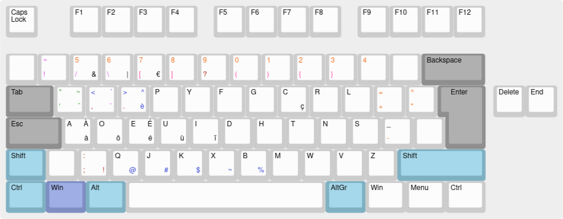

Here is my solution to changing the keyboard layout (via xkb configuration) when you don't have root privileges.

Take note that you won't be able to apply your keyboard layout before you log in.
Also this method won't work properly if you're using wayland (For example switch from GNOME which uses wayland to GNOME-Xorg).
If you still want to use wayland, I haven't found any work around besides tweaking the /usr/share/X11/ folder (which requires root privileges).

# Installation

This configuration works on Debian 11 with GNOME_Xorg

To install :

run `git clone https://github.com/dams3/custom-user-kbdLayout.git`

then copy the folder 'keyboard' into your home directory (`cp -r ./keyboard $HOME`)

make sure the kbdlayout.sh can be executed (use chmod if not)

Modify the shell script to your liking (for example you can take out the option "caps:shiftlock"

copy the file 'customKbdLayout.desktop' into your '~/.config/autostart/', modify the 'Exec' path from '/home/dams/' to your home directory and delete the 'X-GNOME-Autostart-enabled=true' if your not using GNOME

modify the layout as you please (the 'mycustomlayout' file in '~/keyboard/symbols/', you can also find other layouts currently on your machine in '/usr/share/X11/xkb/symbols/')

Your done. To test the layout right now run the shell script : `bash ~/keyboard/kbdlayout.sh`

# My layout

I use my own layout based on dvorak, which I've adapted to be able to also write in French.
I've also adapted it to my programming needs.

Here is my layout :

  <figure>
  
  </figure>

# Usefull links

1. Find more information about `keycodes`, `keysymbols` and `XKB` in this
   [basics part](https://www.charvolant.org/doug/xkb/html/node3.html)
   of the article
   [An Unreliable Guide to XKB Configuration description](https://www.charvolant.org/doug/xkb/html/xkb.html) from
   Doug Palmer.
2. For those that wants to try a global installation (need root privileges) :
   [Tony Aldon's keyboard layout](https://github.com/tonyaldon/keyboard-layout)
3. A link to the website I used to generate my layout's png :
   [My layout on keyboard-layout-editor.com](http://www.keyboard-layout-editor.com/##@@=Caps%20Lock&_x:1%3B&=F1&=F2&=F3&=F4&_x:0.5%3B&=F5&=F6&=F7&=F8&_x:0.5%3B&=F9&=F10&=F11&=F12%3B&@_y:0.5&a:7%3B&=&_t=%23c300d9&a:4%3B&=~%0A!&_t=%23cf5900%0A%23c300d9%3B&=5%0A%2F%2F%0A%0A%2F&&=6%0A%5C%0A%0A%7C&_t=%23cf5900%0A%23ff007a%3B&=7%0A%5B%0A%0A%E2%82%AC&=8%0A%5D&_t=%23cf5900%0A%239e0d0d%3B&=9%0A%3F&_t=%23cf5900%0A%23ff007a%3B&=0%0A(&=1%0A)&=2%0A%7B&_t=%23cf5900%0A%23ff007a%0A%0A%23cf5900%3B&=3%0A%7D&_t=%23cf5900%0A%0A%0A%23cf5900%3B&=4&_t=%23000000&a:7%3B&=&_c=%238f8f8f&a:4&w:2%3B&=Backspace%3B&@_w:1.5%3B&=Tab&_c=%23cccccc&t=%23138709%3B&=%22%0A'%0A~%0A%C2%A8&_t=%231138c2%0A%239e0d0d%0A%0A%23c300d9%3B&=%3C%0A,%0A%C2%B4%0A%60&_t=%231138c2%0A%239e0d0d%3B&=%3E%0A.%0A%5E%0A%C3%A8&_t=%23000000%3B&=P&=Y&_t=%23000000%0A%0A%0A%23ff007a%3B&=F&=G&_t=%23000000%3B&=C%0A%0A%0A%C3%A7&_t=%23000000%0A%0A%0A%23cf5900%3B&=R&=L&_t=%23cf5900%0A%23cf5900%0A%0A%23cf5900%3B&=%2F=%0A+&_t=%23cf5900%0A%23cf5900%3B&=%5E%0A*&_x:0.25&c=%238f8f8f&t=%23000000&w:1.25&h:2&w2:1.5&h2:1&x2:-0.25%3B&=Enter&_x:0.25&c=%23cccccc%3B&=Delete&=End%3B&@_c=%238f8f8f&w:1.75%3B&=Esc&_c=%23cccccc%3B&=A%0A%0A%C3%80%0A%C3%A0&=O%0A%0A%0A%C3%B4&=E%0A%0A%C3%89%0A%C3%A9&=U%0A%0A%0A%C3%B9&=I%0A%0A%0A%C3%AF&_t=%23000000%0A%0A%23ff007a%0A%23ff007a%3B&=D&=H&_t=%23000000%0A%0A%0A%23cf5900%3B&=T&=N&=S&_t=%23000000%0A%23cf5900%0A%0A%23cf5900%3B&=%2F_%0A-&_t=%23000000&a:7%3B&=%3B&@_c=%237eb0c2&a:4&w:1.25%3B&=Shift&_c=%23cccccc&a:7%3B&=&_t=%239e0d0d&a:4%3B&=%2F:%0A%2F%3B%0A%0A!&_t=%23000000%0A%0A%0A%231138c2%3B&=Q%0A%0A%0A%2F@&=J%0A%0A%0A%23&=K%0A%0A%0A$&=X%0A%0A%0A~&=B%0A%0A%0A%25&_t=%23000000%0A%0A%0A%23cf5900%3B&=M&=W&_t=%23000000%0A%0A%0A%239e0d0d%3B&=V&_t=%23000000%0A%0A%23cf5900%0A%23cf5900%3B&=Z&_c=%237eb0c2&t=%23000000&w:2.75%3B&=Shift%3B&@_w:1.25%3B&=Ctrl&_c=%237e8dc2&w:1.25%3B&=Win&_c=%237eb0c2&w:1.25%3B&=Alt&_c=%23cccccc&a:7&w:6.25%3B&=&_c=%237eb0c2&a:4&w:1.25%3B&=AltGr&_c=%23cccccc&w:1.25%3B&=Win&_w:1.25%3B&=Menu&_w:1.25%3B&=Ctrl)
